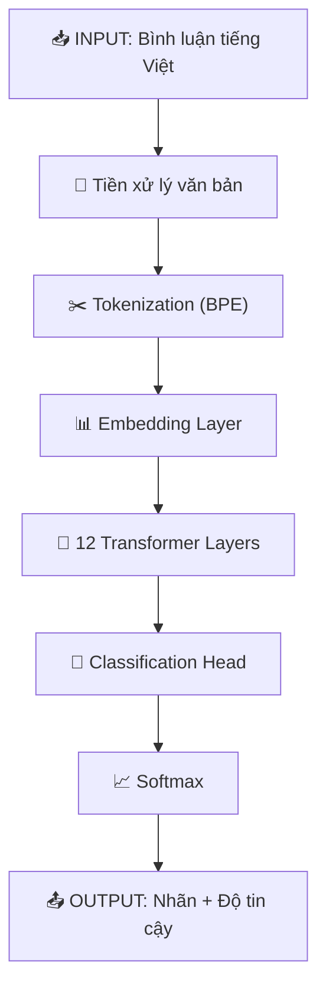

# 🎯 GIẢI THÍCH CHI TIẾT MÔ HÌNH PHÂN TÍCH CẢM XÚC PHOBERT

---

## 📌 TỔNG QUAN HỆ THỐNG

> [!NOTE]
> Hệ thống sử dụng **PhoBERT** (Vietnamese BERT) - mô hình ngôn ngữ được huấn luyện trên 20GB dữ liệu tiếng Việt bởi VinAI Research.

### Phân loại cảm xúc

| 🏷️ Nhãn | 🔢 Giá trị | 📝 Ý nghĩa |
|:-------:|:----------:|:----------:|
| 😊 **POSITIVE** | `0` | Tích cực |
| 😐 **NEUTRAL** | `1` | Trung tính |
| 😟 **NEGATIVE** | `2` | Tiêu cực |

---

## 📐 PHẦN 1: KIẾN TRÚC PHOBERT

### 1.1 Thông số mô hình

| 📊 Thông số | 🔢 Giá trị | 📖 Ý nghĩa tiếng Việt |
|:------------|:----------:|:----------------------|
| **Hidden size (H)** | `768` | Kích thước vector ẩn |
| **Num layers** | `12` | Số lớp Transformer |
| **Num attention heads** | `12` | Số đầu attention |
| **Vocab size** | `~64,000` | Kích thước từ điển |
| **Max position** | `256` | Độ dài tối đa của câu |

---

## 🔢 PHẦN 2: CÁC CÔNG THỨC CHÍNH

### 2.1 EMBEDDING LAYER (Lớp nhúng)

> **Công thức 1:** Word + Position + Segment Embedding

$$E = E_{token} + E_{position} + E_{segment}$$

| 🔤 Ký hiệu | 📛 Tên tiếng Việt | 📖 Mô tả chi tiết |
|:----------:|:------------------|:------------------|
| **E** | Vector nhúng cuối cùng | Vector đầu vào cho Transformer (768 chiều) |
| **E_token** | Vector nhúng từ | Biểu diễn ngữ nghĩa của token |
| **E_position** | Vector nhúng vị trí | Mã hóa vị trí token trong câu |
| **E_segment** | Vector nhúng phân đoạn | Phân biệt câu A và câu B |

---

### 2.2 SELF-ATTENTION (Cơ chế tự chú ý)

> **Công thức 2:** Tính ma trận Q, K, V

$$Q = XW^Q \quad K = XW^K \quad V = XW^V$$

| 🔤 Ký hiệu | 📛 Tên tiếng Việt | 📏 Kích thước | 📖 Mô tả |
|:----------:|:------------------|:-------------:|:---------|
| **X** | Ma trận đầu vào | (n × 768) | n = số token |
| **W^Q** | Ma trận trọng số Query | (768 × 64) | Trọng số học được |
| **W^K** | Ma trận trọng số Key | (768 × 64) | Trọng số học được |
| **W^V** | Ma trận trọng số Value | (768 × 64) | Trọng số học được |
| **Q** | Ma trận Query | (n × 64) | "Câu hỏi" - từ hiện tại muốn tìm gì |
| **K** | Ma trận Key | (n × 64) | "Chìa khóa" - từ khác có gì |
| **V** | Ma trận Value | (n × 64) | "Giá trị" - thông tin thực sự |

---

> **Công thức 3:** Scaled Dot-Product Attention

$$\text{Attention}(Q, K, V) = \text{softmax}\left(\frac{QK^T}{\sqrt{d_k}}\right)V$$

| 🔢 Bước | 📐 Công thức | 📖 Ý nghĩa | 📏 Kích thước |
|:-------:|:-------------|:-----------|:-------------:|
| 1️⃣ | `QK^T` | Tích vô hướng giữa query và key | (n × n) |
| 2️⃣ | `QK^T / √d_k` | Chia cho √64=8 để ổn định gradient | (n × n) |
| 3️⃣ | `softmax(·)` | Chuẩn hóa thành xác suất (tổng = 1) | (n × n) |
| 4️⃣ | `(·) × V` | Nhân với Value để lấy thông tin | (n × d_v) |

---

> **Công thức 4:** Multi-Head Attention

$$\text{MultiHead}(Q, K, V) = \text{Concat}(\text{head}_1, ..., \text{head}_h)W^O$$

| 🔤 Ký hiệu | 📛 Tên tiếng Việt | 📖 Mô tả |
|:----------:|:------------------|:---------|
| **h** | Số đầu attention | 12 heads trong PhoBERT |
| **head_i** | Đầu attention thứ i | Mỗi head học một quan hệ khác nhau |
| **Concat** | Phép nối | Ghép 12 vectors lại thành 1 |
| **W^O** | Ma trận output | Chiếu kết quả về kích thước ban đầu |

---

### 2.3 FEED-FORWARD NETWORK

> **Công thức 5:** Position-wise Feed-Forward

$$\text{FFN}(x) = \text{GELU}(xW_1 + b_1)W_2 + b_2$$

| 🔤 Ký hiệu | 📛 Tên tiếng Việt | 📏 Kích thước | 📖 Mô tả |
|:----------:|:------------------|:-------------:|:---------|
| **x** | Vector đầu vào | (768,) | Output từ attention layer |
| **W_1** | Ma trận trọng số 1 | (768 × 3072) | Mở rộng lên 4x |
| **b_1** | Bias 1 | (3072,) | Độ lệch |
| **W_2** | Ma trận trọng số 2 | (3072 × 768) | Thu nhỏ về kích thước gốc |
| **b_2** | Bias 2 | (768,) | Độ lệch |
| **GELU** | Hàm kích hoạt | - | Gaussian Error Linear Unit |

---

> **Công thức 6:** GELU Activation

$$\text{GELU}(x) = 0.5x\left(1 + \tanh\left[\sqrt{\frac{2}{\pi}}(x + 0.044715x^3)\right]\right)$$

---

### 2.4 LAYER NORMALIZATION

> **Công thức 7:** Layer Normalization

$$\text{LayerNorm}(x) = \gamma \cdot \frac{x - \mu}{\sqrt{\sigma^2 + \epsilon}} + \beta$$

| 🔤 Ký hiệu | 📛 Tên tiếng Việt | 📖 Mô tả |
|:----------:|:------------------|:---------|
| **x** | Vector đầu vào | Vector 768 chiều |
| **μ** | Trung bình | μ = (1/d)∑x_i |
| **σ²** | Phương sai | σ² = (1/d)∑(x_i - μ)² |
| **ε** | Hằng số nhỏ | Thường = 1e-6, tránh chia cho 0 |
| **γ** | Hệ số tỷ lệ | Tham số học được (khởi tạo = 1) |
| **β** | Độ lệch | Tham số học được (khởi tạo = 0) |

---

### 2.5 RESIDUAL CONNECTION

> **Công thức 8:** Add & Norm

$$\text{Output} = \text{LayerNorm}(x + \text{Sublayer}(x))$$

| 🔤 Thành phần | 📖 Mô tả |
|:--------------|:---------|
| **x** | Đầu vào ban đầu |
| **Sublayer(x)** | Output từ Attention hoặc FFN |
| **x + Sublayer(x)** | Cộng shortcut - giữ thông tin gốc |
| **LayerNorm** | Chuẩn hóa kết quả |

---

## 🎯 PHẦN 3: CLASSIFICATION HEAD

### 3.1 Tính Logits

> **Công thức 9:** Linear Classification Layer

$$\text{logits} = h_{[CLS]} \cdot W_c + b_c$$

| 🔤 Ký hiệu | 📛 Tên tiếng Việt | 📏 Kích thước | 📖 Mô tả |
|:----------:|:------------------|:-------------:|:---------|
| **h_[CLS]** | Vector CLS | (768,) | Đại diện câu từ BERT |
| **W_c** | Ma trận phân loại | (768 × 3) | 3 = số lớp |
| **b_c** | Bias phân loại | (3,) | Độ lệch |
| **logits** | Điểm số thô | (3,) | Chưa chuẩn hóa |

---

### 3.2 Softmax Function

> **Công thức 10:** Chuyển Logits thành Xác suất

$$P(y=k|x) = \text{softmax}(z)_k = \frac{e^{z_k}}{\sum_{j=1}^{K} e^{z_j}}$$

| 🔤 Ký hiệu | 📛 Tên tiếng Việt | 📖 Mô tả |
|:----------:|:------------------|:---------|
| **z_k** | Logit của lớp k | Điểm số thô cho lớp k |
| **e^z_k** | Số mũ cơ số e | Đảm bảo giá trị dương |
| **K** | Số lớp | K = 3 (positive, neutral, negative) |
| **P(y=k\|x)** | Xác suất lớp k | Xác suất câu x thuộc lớp k |

---

### 📊 Ví dụ tính toán Softmax

```
Bước 1: logits = [2.5, 0.3, -1.2]
        (tương ứng: positive, neutral, negative)

Bước 2: Tính e^z
        e^2.5  = 12.18
        e^0.3  = 1.35
        e^-1.2 = 0.30
        Tổng   = 13.83

Bước 3: Tính xác suất
        P(positive) = 12.18 / 13.83 = 0.88 (88%)
        P(neutral)  = 1.35 / 13.83  = 0.10 (10%)
        P(negative) = 0.30 / 13.83  = 0.02 (2%)

Kết quả: POSITIVE với độ tin cậy 88%
```

---

## 📉 PHẦN 4: HÀM MẤT MÁT (TRAINING)

> **Công thức 11:** Cross-Entropy Loss

$$\mathcal{L} = -\sum_{k=1}^{K} y_k \log(p_k) = -\log(p_{target})$$

| 🔤 Ký hiệu | 📛 Tên tiếng Việt | 📖 Mô tả |
|:----------:|:------------------|:---------|
| **L** | Loss (Mất mát) | Giá trị cần tối thiểu hóa |
| **y_k** | Nhãn one-hot | 1 nếu k là nhãn đúng, 0 nếu không |
| **p_k** | Xác suất dự đoán | Softmax output cho lớp k |
| **p_target** | Xác suất nhãn đúng | Xác suất model gán cho nhãn thực |

---

## 📈 PHẦN 5: CÔNG THỨC THỐNG KÊ

### 5.1 Tính phần trăm

> **Công thức 12:** Percentage

$$\text{Percentage}_{label} = \frac{\text{Count}_{label}}{\text{Total}} \times 100\%$$

### 5.2 Độ tin cậy trung bình

> **Công thức 13:** Average Confidence

$$\bar{C} = \frac{1}{n} \sum_{i=1}^{n} c_i$$

| 🔤 Ký hiệu | 📛 Tên tiếng Việt | 📖 Mô tả |
|:----------:|:------------------|:---------|
| **C̄** | Độ tin cậy trung bình | Giá trị từ 0 đến 1 |
| **n** | Số bình luận | Tổng số bình luận được phân tích |
| **c_i** | Độ tin cậy thứ i | Xác suất cao nhất của bình luận i |

---

## 🔄 PHẦN 6: SƠ ĐỒ LUỒNG XỬ LÝ



---

## 📋 PHẦN 7: TÓM TẮT TẤT CẢ CÔNG THỨC

| # | 📐 Công thức | 🎯 Mục đích |
|:-:|:-------------|:------------|
| 1 | E = E_token + E_position + E_segment | Nhúng từ vào không gian vector |
| 2 | Q = XW^Q, K = XW^K, V = XW^V | Tính Query, Key, Value |
| 3 | Attention = softmax(QK^T/√d_k)V | Self-Attention |
| 4 | MultiHead = Concat(heads)W^O | Multi-Head Attention |
| 5 | FFN = GELU(xW_1 + b_1)W_2 + b_2 | Feed-Forward Network |
| 6 | GELU(x) = 0.5x(1 + tanh[...]) | Hàm kích hoạt |
| 7 | LayerNorm(x) = γ(x-μ)/√(σ²+ε) + β | Chuẩn hóa lớp |
| 8 | Output = LayerNorm(x + Sublayer(x)) | Residual connection |
| 9 | logits = h_[CLS] × W_c + b_c | Phân loại |
| 10 | P(k) = e^z_k / Σe^z_j | Softmax |
| 11 | L = -log(p_target) | Cross-entropy loss |
| 12 | %_label = Count/Total × 100 | Phần trăm thống kê |
| 13 | C̄ = (1/n)Σc_i | Độ tin cậy trung bình |

---

## 🖥️ PHẦN 8: CODE THAM KHẢO

Xem file: [sentiment_analyzer.py](file:///d:/LVTN/LVTN2025/sentiment-analysis-system/backend/src/services/sentiment_analyzer.py)

### Hàm dự đoán chính:

```python
def predict_sentiment_ml(self, text: str) -> Tuple[SentimentLabel, float]:
    # Bước 1: Tiền xử lý văn bản
    processed_text = self.preprocess_text(text)
    
    # Bước 2: Tokenize
    inputs = self.vectorizer(
        processed_text, 
        return_tensors="pt",
        truncation=True, 
        padding=True, 
        max_length=256
    )
    
    # Bước 3: Forward pass qua PhoBERT
    with torch.no_grad():
        outputs = self.model(**inputs)
        logits = outputs.logits
        
        # Bước 4: Softmax để lấy xác suất
        probabilities = torch.softmax(logits, dim=1)[0]
        
        # Bước 5: Lấy nhãn có xác suất cao nhất
        prediction = torch.argmax(probabilities).item()
        confidence = float(probabilities[prediction])
    
    # Bước 6: Map sang nhãn cảm xúc
    sentiment_map = {
        0: SentimentLabel.POSITIVE,   # Tích cực
        1: SentimentLabel.NEUTRAL,    # Trung tính
        2: SentimentLabel.NEGATIVE,   # Tiêu cực
    }
    
    return sentiment_map[prediction], confidence
```

---

> [!IMPORTANT]
> **Lưu ý:** Mô hình PhoBERT đã được fine-tune đặc biệt cho tiếng Việt, vì vậy nó hiểu được các đặc trưng ngữ pháp và ngữ nghĩa của tiếng Việt tốt hơn các mô hình BERT tiếng Anh.
